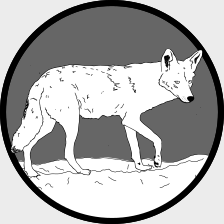

A repository for:
================

Murray et al. (*in press*). A multi-state occupancy model to non-invasively monitor visible signs of wildlife health with camera traps that accounts for image quality. Journal of Animal Ecology.

---

This repository contains seven folders. In alphabetical order they are:

---

 <h3>./assets</h3> 

---

Contains two images used to make `README.md`. This includes:

 **`./assets/coyote.png`**: A line drawing of a coyote.
 
 **`./assets/coyote_mange.png`**: A line drawing of a mangy coyote.

---

 <h3>./data</h3> 

---

This folder contains the data to fit the model and a set of gridpoints as a shapefile used to generate figure 5 in the manuscript. 

**`./data/coydata_merged_sites.csv`**: A csv file with 3971 rows and 11 columns that contains all of the image data used in the analysis.

| Column header       | Data type   | Description                                                                               |
|---------------------|-------------|-------------------------------------------------------------------------------------------|
| new_file_name       | character   | The name of the coyote image, which generally uses a site code.                           |
| blur                | numeric     | The blur value calculated by the python script. Higher values indicate increased clarity. |
| File_name_order     | integer     | The numeric order of images at a site.                                                    |
| Mange_signs_present | boolean     | Takes a value of 1 if mange was detected in an image, otherwise it is 0.                  |
| In_color            | boolean     | Takes a value of 1 if the image is in color, otherwise it is 0 (i.e., greyscale).         |
| Season              | categorical | The season the photo was collected. Either Spring, Summer, Fall, or Winter.               |
| Year                | integer     | The year the photo was collected.                                                         |
| propbodyvis         | proportion  | The proportion a coyote was visible in an image, ranges from 0 to 0.55                    |
| surveyid            | character   | The survey code for a photo. Combines seasonal, year, and site information.               |
| site                | character   | The site the image occured at.                                                            |
| date                | date        | The date the image was taken                                                              |

**`coyote_detection_data.csv`**: A csv with 54656 rows and 8 columns that contains all of the coyote detection / non-detection data used in the analysis.

| Column header | Data type   | Description                                                                                                                                                                                                                                    |
|---------------|-------------|------------------------------------------------------------------------------------------------------------------------------------------------------------------------------------------------------------------------------------------------|
| Season        | categorical | A seasonal code for the season the data comes from. It combines the first two letters of the season and the last two digits of the year. Seasonal codes are SP = Spring, SU = Summer, FA = Fall, WI = Winter. Data collection started in 2010. |
| Week          | categorical | The week of a given primary sampling period. Week 1 through Week 4.                                                                                                                                                                            |
| Date          | date        | The date of the coyote detection / non-detection data. In `yyyy/mm/dd` format.                                                                                                                                                                 |
| SeasonWeek    | categorical | Just a combination of Season and Week columns.                                                                                                                                                                                                 |
| StationID     | categorical | The site code for the detection / non-detection data. Can be joined to the `site` column in `coydata_merged_sites.csv`                                                                                                                         |
| SurveyID      | categorical | The survey code for the detection / non-detection data. Can be joined to the `surveyid` column in `coydata_merged_sites.csv`                                                                                                                   |
| IDWeek        | categorical | Just a combination of the StationID and the Date                                                                                                                                                                                               |
| Coyote        | Integer     | Can take three values. `NA` if a camera was not active, `0` if the camera was active and coyote were not detected, and `1` if the camera was active and coyote were detected.                                                                  |

