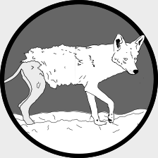

A repository for:
================

Murray et al. (*in press*). A multi-state occupancy model to non-invasively monitor visible signs of wildlife health with camera traps that accounts for image quality. Journal of Animal Ecology.

---

This repository contains seven folders. In alphabetical order they are:

---

 <h3>./assets/</h3> 

---

Contains two images used to make `README.md`. This includes:

 **`./assets/coyote.png`**: A line drawing of a coyote.
 
 **`./assets/coyote_mange.png`**: A line drawing of a mangy coyote.

---

 <h3>./data/</h3> 

---

This folder contains the data to fit the model and a set of gridpoints as a shapefile used to generate figure 5 in the manuscript. 

**`./data/coydata_merged_sites.csv`**: A csv file with 3971 rows and 11 columns that contains all of the image data used in the analysis.

| Column header       | Data type   | Description                                                                               |
|---------------------|-------------|-------------------------------------------------------------------------------------------|
| new_file_name       | character   | The name of the coyote image, which generally uses a site code.                           |
| blur                | numeric     | The blur value calculated by the python script. Higher values indicate increased clarity. |
| File_name_order     | integer     | The numeric order of images at a site.                                                    |
| Mange_signs_present | boolean     | Takes a value of 1 if mange was detected in an image, otherwise it is 0.                  |
| In_color            | boolean     | Takes a value of 1 if the image is in color, otherwise it is 0 (i.e., greyscale).         |
| Season              | categorical | The season the photo was collected. Either Spring, Summer, Fall, or Winter.               |
| Year                | integer     | The year the photo was collected.                                                         |
| propbodyvis         | proportion  | The proportion a coyote was visible in an image, ranges from 0 to 0.55                    |
| surveyid            | character   | The survey code for a photo. Combines seasonal, year, and site information.               |
| site                | character   | The site the image occured at.                                                            |
| date                | date        | The date the image was taken                                                              |

**`coyote_detection_data.csv`**: A csv with 54656 rows and 8 columns that contains all of the coyote detection / non-detection data used in the analysis.

| Column header | Data type   | Description                                                                                                                                                                                                                                    |
|---------------|-------------|------------------------------------------------------------------------------------------------------------------------------------------------------------------------------------------------------------------------------------------------|
| Season        | categorical | A seasonal code for the season the data comes from. It combines the first two letters of the season and the last two digits of the year. Seasonal codes are SP = Spring, SU = Summer, FA = Fall, WI = Winter. Data collection started in 2010. |
| Week          | categorical | The week of a given primary sampling period. Week 1 through Week 4.                                                                                                                                                                            |
| Date          | date        | The date of the coyote detection / non-detection data. In `yyyy/mm/dd` format.                                                                                                                                                                 |
| SeasonWeek    | categorical | Just a combination of Season and Week columns.                                                                                                                                                                                                 |
| StationID     | categorical | The site code for the detection / non-detection data. Can be joined to the `site` column in `coydata_merged_sites.csv`                                                                                                                         |
| SurveyID      | categorical | The survey code for the detection / non-detection data. Can be joined to the `surveyid` column in `coydata_merged_sites.csv`                                                                                                                   |
| IDWeek        | categorical | Just a combination of the StationID and the Date                                                                                                                                                                                               |
| Coyote        | Integer     | Can take three values. `NA` if a camera was not active, `0` if the camera was active and coyote were not detected, and `1` if the camera was active and coyote were detected.                                                                  |

**`./data/gridpoint.shp`**: A shapefile of the gridpoints used to predict coyote and coyote with mange throughout the greater Chicagoland area (figure 5). The utm coordinate
reference system for this file is `26916`.

**`./data/map_data/coyote_mange_hu10.csv`**: The housing density calculated at
each of the gridpoints for figure 5. This csv is 28329 rows by 2 columns.

| Column header | Data type | Description                                                                                                                                                  |
|---------------|-----------|--------------------------------------------------------------------------------------------------------------------------------------------------------------|
| LocationName  | integer   | The site code from the gridpoints shapefile.                                                                                                                 |
| HU10          | numeric   | The housing density (houses per km squared) in a 1 km buffer around each gridpoint. Data comes from http://silvis.forest.wisc.edu/data/housing-block-change/ |

**`./data/map_data/tree_imperv_mapdata.csv`**: The tree cover and impervious cover calculated at each of the gridpoints for figure 5. This csv is 28329 by 3 columns.

| Column header | Data type | Description                                                                                                                                                                           |
|---------------|-----------|---------------------------------------------------------------------------------------------------------------------------------------------------------------------------------------|
| LocationName  | integer   | The site code from the gridpoints shapefile.                                                                                                                                          |
| tree          | percent   | Percent tree cover in a 1 km buffer around each gridpoint. Data comes from https://datahub.cmap.illinois.gov/dataset/high-resolution-land-cover-ne-illinois-and-nw-indiana-2010       |
| imperv        | percent   | Percent impervious cover in a 1 km buffer around each gridpoint. Data comes from https://datahub.cmap.illinois.gov/dataset/high-resolution-land-cover-ne-illinois-and-nw-indiana-2010 |

**`./data/model_covariates.csv`**: The  covariates used to generate the two
urbanization metrics via Principal Components Analysis. This csv has 113 rows and 4 columns.

| Column header | Data type   | Description                                                                                                                                                                      |
|---------------|-------------|----------------------------------------------------------------------------------------------------------------------------------------------------------------------------------|
| site          | categorical | The site code where data was collected.                                                                                                                                          |
| house         | numeric     | The housing density (houses per km squared) in a 1 km buffer around each site. Data comes from http://silvis.forest.wisc.edu/data/housing-block-change/                          |
| tree          | percent     | Percent tree cover in a 1 km buffer around each site. Data comes from https://datahub.cmap.illinois.gov/dataset/high-resolution-land-cover-ne-illinois-and-nw-indiana-2010       |
| imperv        | percent     | Percent impervious cover in a 1 km buffer around each site. Data comes from https://datahub.cmap.illinois.gov/dataset/high-resolution-land-cover-ne-illinois-and-nw-indiana-2010 |

**`./data/raw_site_coords.csv`**: The UTMs of the camera trapping sites. These sites are in zone 16N.

| Column header | Data type   | Description                            |
|---------------|-------------|----------------------------------------|
| site          | categorical | The site code where data was collected |
| utmEast       | numeric     | The easting coordinate                 |
| utmNorth      | numeric     | The northing coordinate                |

---

 <h3>./im_calls/</h3> 

---

This folder just contains one script, titled `figure_3_calls.txt`. I used imagemagick to combine the two subplots for figure 2 and add in the a) and b) symbols. These are just the notes I took in a text file so I could remember what to call from the console.

---

 <h3>./jags_script/</h3> 

---

This folder contains three JAGS scripts, all of which are different parameterizations of the model we developed in the manuscript.

**`./jags_script/conditional_model.R`**: This is  the multi-season model without an autologistic term (i.e., assumes samples are independent among seasons).

**`./jags_script/conditional_model_autologistic.R`**: The is the multi-season model with an autologistic term, and the one we fit to our coyote data. All of the scripts (e.g., plotting) assume this is the model that is fit.

**`./jags_script/conditional_model_single_season.R`**: This isthe single season model we used for our simulated example. 

---

 <h3>./plots/</h3> 

---
Contains plots 3, 4, and 5 of the manuscript, as well as the model evaluation plots for the supplemental material (within it's own subfolder).

---

 <h3>./python/</h3> 

---

Contains a single script, `blur_detection.py`, which is what we used to calculate the blur metric for all of the coyote images in our analysis.

---

 <h3>./R/</h3> 

---

Contains the seven R scripts for this analysis.  If you were to run them in order they would go.

**`./R/prep_data.R`**: A script that prepares all of the coyote data for analysis.

**`./R/fit_conditional_mange_model.R`**: This fits the autologistic conditional mange model.

**`./R/evaluate_mange_model.R`**: This calculates some model diagnostics.

**`./R/summarize_conditional_mange_model.R`**: This summarizes the model and plots out some of the results.

**`./R/mange_map.R`**: This plots out the distribution of coyote, mangy or otherwise, and mangy coyote throughout Chicago, based on our model.

**`./R/model_simulation_example.Rmd`**: A markdown file that generates one of the supplemental files, which walks through a single season example.

**`./R/simulate_conditional_data.R`**: This is the script I initially wrote, which the above markdown file is based on. Keeping it here for folks that just want to work through the R script instead.

---

 <h3>./results/</h3> 

---

It contains just one file, which is a summary of the conditional mange model with an autologistic term, fit to the coyote data, and is generated in
`./R/summarisze_conditional_mange_model.R`. The row names of the file are informative (i.e., contain parameter names), while the rest of the columns are the median estimates of a parameter, associated 95% credible interval, and whether or not the 95% credibible interval excludes zero.

